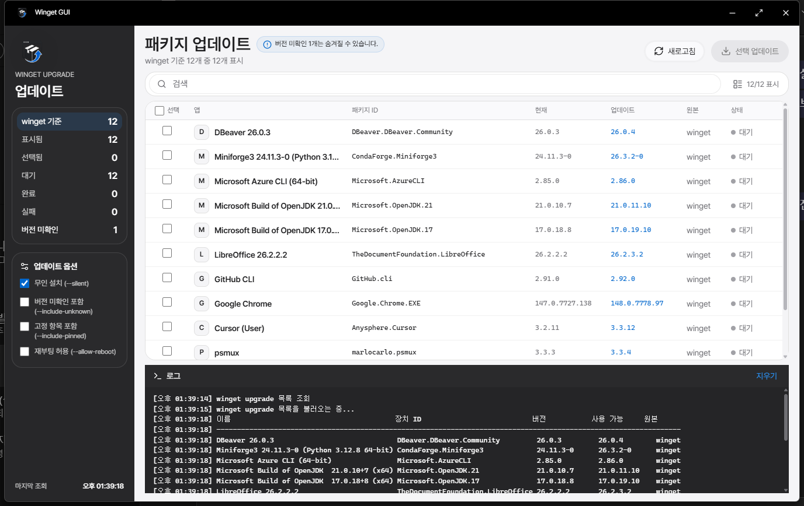
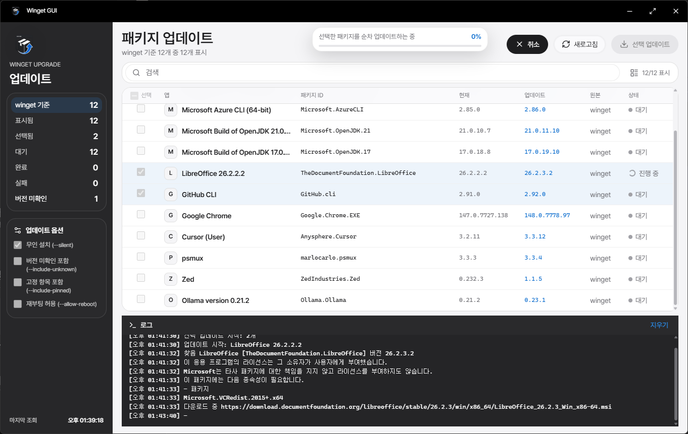

# Winget GUI

Windows `winget`을 GUI 형태로 만들어 원하는 패키지만 골라 업데이트하는 Electron 데스크톱 앱입니다.





## 주요 기능

- `winget upgrade` 결과를 패키지 이름, ID, 현재 버전, 업데이트 버전, 원본 기준으로 표시
- 원하는 항목만 체크해서 순차 업데이트
- 이름, 패키지 ID, 버전 검색
- 무인 설치, 버전 미확인 패키지 포함, 고정 항목 포함 옵션 지원
- 실행 시 관리자 권한(UAC) 자동 요청
- 업데이트 상태와 `winget` 로그 표시

## 요구 사항

- Windows 10/11
- `winget` 사용 가능 환경
- 개발 또는 패키징 시 Node.js와 npm

## 실행

의존성을 설치한 뒤 데스크톱 앱을 실행합니다.

```powershell
npm install
npm start
```

`npm start`는 렌더러를 빌드한 뒤 Electron 앱으로 실행합니다. 브라우저에서 `dist/index.html`만 열면 Windows `winget` API에 접근할 수 없어 실제 기능은 동작하지 않습니다.

개발 중 hot reload가 필요하면 아래 명령을 사용합니다.

```powershell
npm run dev:app
```

## 포터블 exe 만들기

```powershell
npm run portable
```

성공하면 아래 파일이 생성됩니다.

```text
release\Winget GUI Portable\Winget GUI.exe
```

`release\Winget GUI Portable` 폴더를 통째로 옮기면 설치 없이 exe 더블클릭으로 실행할 수 있습니다.

## 관리자 권한

배포된 exe(포터블/설치본)는 실행 시 매니페스트에 의해 자동으로 관리자 권한(UAC)을 요청합니다. 설치/제거에 관리자 권한이 필요한 패키지를 업데이트할 수 있도록 항상 승격된 상태로 시작합니다.

`npm start`, `npm run dev:app`로 실행하는 개발 모드에서는 매니페스트가 적용되지 않아 일반 권한으로 시작합니다. 필요하면 앱 안의 "관리자 재시작" 버튼으로 승격할 수 있습니다.

항상 관리자 권한으로 실행되므로 포터블 폴더가 변조되면 그 코드도 관리자 권한으로 실행됩니다. 현재 빌드는 코드 서명되지 않았으므로, 일반 사용자가 임의로 쓸 수 없는 신뢰할 수 있는 경로에 두고 사용하세요.

## 업데이트 동작

선택한 패키지는 각 항목마다 정확한 패키지 ID로 순차 업데이트됩니다.

```powershell
winget upgrade --id <패키지ID> --exact --accept-package-agreements --accept-source-agreements --disable-interactivity --silent
```

앱 옵션에 따라 다음 인자가 추가될 수 있습니다.

| 옵션 | winget 인자 | 설명 |
| --- | --- | --- |
| 무인 설치 | `--silent` | 설치 프로그램이 지원하면 확인 창 없이 실행합니다. |
| 버전 미확인 포함 | `--include-unknown` | 현재 버전을 알 수 없는 패키지도 목록과 업데이트 대상에 포함합니다. |
| 고정 항목 포함 | `--include-pinned` | winget에서 고정된 항목도 차단되지 않는 경우 포함합니다. |

## 검증

```powershell
npm test
npm run build
```

포터블 exe까지 확인하려면 다음 명령을 실행합니다.

```powershell
npm run portable
```

## 프로젝트 구조

```text
electron/              Electron 메인 프로세스, preload, winget 실행 로직
src/                   React 렌더러 UI
public/                정적 앱 아이콘
docs/images/           README용 스크린샷
scripts/               포터블 패키징 스크립트
tests/                 winget 파서와 패키징 테스트
release/               생성된 포터블 앱 출력물
```
